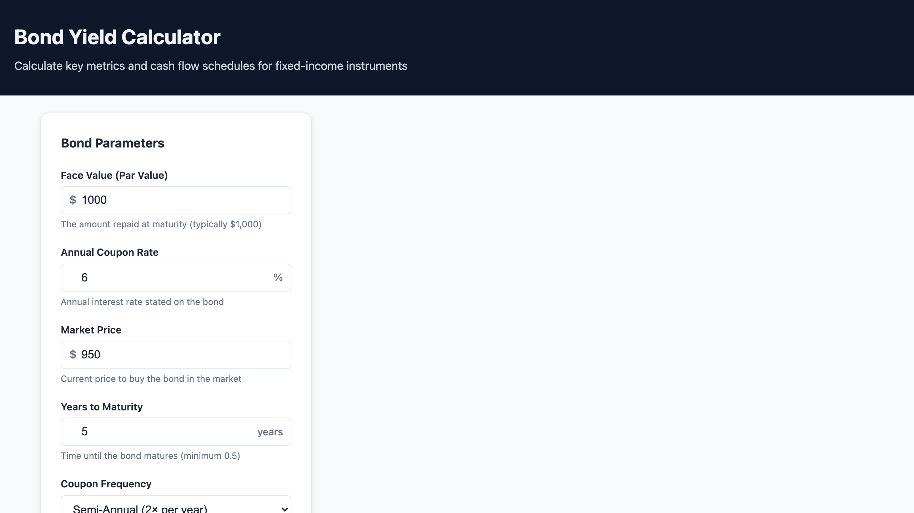

# Bond Yield Calculator

A full-stack monorepo that calculates core fixed-income metrics for plain-vanilla bonds:

- Current Yield
- Yield to Maturity (YTM)
- Total Interest Earned
- Premium/Discount status
- Full cash flow schedule by period



## Live Demo

- Frontend: `https://16.25.121.8`
- Backend: `https://16.25.121.8/api/v1`
- Health Check: `https://16.25.121.8/health`

## Architecture

This project uses npm workspaces in a monorepo:

- `packages/shared`: shared bond domain types and financial calculation logic
- `packages/backend`: Express API (TypeScript)
- `packages/frontend`: React + Vite UI (TypeScript)

Calculation logic is centralized in the shared package to avoid duplication and keep backend/frontend behavior consistent.

Financial calculations use decimal-safe arithmetic with `decimal.js`. Numeric inputs are preserved as decimal strings at the API boundary, and backend outputs are returned as decimal strings so binary floating-point error does not leak into production calculations.

Production deployment steps for the EC2 setup are documented in [DEPLOYMENT.md](./DEPLOYMENT.md).

## Prerequisites

- Node.js >= 18
- npm >= 9

## Setup

1. Clone repository

```bash
git clone <your-repo-url>
cd bond-yield-calculator
```

2. Install dependencies

```bash
npm install
```

3. Configure environment

```bash
cp .env.example packages/backend/.env
```

4. Run full stack in development

```bash
npm run dev
```

- Frontend: `http://localhost:5173`
- Backend: `http://localhost:3001`

## Development Commands

```bash
# Start frontend + backend together
npm run dev

# Start only backend
npm run dev --workspace=packages/backend

# Start only frontend
npm run dev --workspace=packages/frontend

# Build all packages
npm run build

# Run all tests
npm test

# Run only shared unit tests
npm test --workspace=packages/shared
```

## Financial Concepts

- Current Yield: annual coupon payment divided by current market price.
- Yield to Maturity (YTM): annualized return when holding the bond to maturity, solved numerically using bisection.
- Precision model: money and yield calculations are performed with decimal arithmetic instead of raw JavaScript floating-point math.
- Premium/Discount:
  - Premium: market price > face value
  - Discount: market price < face value
  - Par: market price == face value
- Cash Flow Schedule: period-by-period coupon payments, cumulative interest, and remaining principal.

## Running Tests

```bash
# Run all workspace tests
npm test

# Run shared package financial unit tests only
npm test --workspace=packages/shared
```
